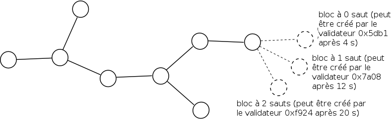

Ethereum 2.0 Mauve Paper
========================

<small><em>Parce que la mauve a plus de RAM...</em></small>

Au cours de la précédente décennie, des projets tels que Bitcoin, Namecoin et Ethereum ont démontré le pouvoir des réseaux de consensus crypto-économiques en apportant une nouvelle étape dans l'évolution des systèmes décentralisés en étendant leur portée, partant d'une simple fourniture de services de stockage de données et de messagerie, pour arriver à la gestion du _back-office_ (base arrière) d'applications _stateful_ (conservant leur état). Les applications proposées et mises en œuvre vont des systèmes de paiement universellement accessibles, tant financièrement que géographiquement, aux contrats financiers en passant par les marchés de prédictions, l'enregistrement de l'identité et de la propriété, la mise en place de systèmes de certificats plus sûrs et même la traçabilité des biens manufacturés au sein des chaînes d'approvisionnement.

Il subsiste néanmoins de sérieuses interrogations sur l'efficience du socle technique utilisé à cet effet. Comme chaque _full node_ (nœud complet) du réseau doit maintenir à jour tout l'état du système et traiter chaque transaction, le réseau ne peut jamais être plus puissant qu'un seul ordinateur. Le mécanisme de consensus le plus souvent utilisé dans les systèmes existants, la _proof of work_ (preuve de travail), doit consommer une très grande quantité d'électricité pour pouvoir fonctionner ; le réseau le plus important, Bitcoin, consommerait autant d'électricité que [l'Irlande toute entière](https://karlodwyer.github.io/publications/pdf/bitcoin_KJOD_2014.pdf).

Ce document propose une solution à ce problème fondée sur la combinaison de _proof of stake_ (preuve d'enjeu) et de _sharding_ (fragmentation). La preuve d'enjeu n'est pas une idée nouvelle (elle date de 2011) mais ce nouvel algorithme présente des avantages substantiels en résolvant les problèmes des systèmes précédents, et en présentant même de nouvelles propriétés qui sont absentes dans la preuve de travail. La preuve d'enjeu peut être vue comme une sorte de « minage virtuel » : alors qu'avec la preuve de travail, les utilisateurs peuvent dépenser de l'argent réel pour acheter des ordinateurs réels qui consomment de l'électricité et produisent aléatoirement des blocs à une fréquence à peu près proportionnelle au coût, dans la preuve d'enjeu, les utilisateurs dépensent de l'argent réel pour acheter de la monnaie virtuelle dans le système puis utilisent un mécanisme interne au protocole pour convertir cette monnaie virtuelle en ordinateurs virtuels simulés par ce protocole pour produire aléatoirement des blocs à une fréquence à peu près proportionnelle au coût, reproduisant ainsi exactement le même effet mais sans la consommation d'électricité. 
La fragmentation n'est pas non plus une nouveauté car elle existe dans les bases de données distribuées depuis une décennie, mais la recherche appliquée à la blockchain est restée très limitée. L'approche de base consiste à relever le défi du passage à l'échelle par une architecture dans laquelle les nœuds d'un ensemble global de validateurs (dans notre cas créé par les cautions de preuve d'enjeu) sont assignés aléatoirement à des « _shards_ » (fragments) spécifiques où chaque fragment traite les transactions en diverses parties de l'état, ceci en parallèle, assurant que le travail est réparti sur les nœuds au lieu d'être effectué par chacun.

Nous désirons atteindre les objectifs suivants :

1. **Efficience par la preuve d'enjeu** - le consensus doit être assuré sans le minage, réduisant ainsi considérablement le gaspillage d'électricité ainsi que le besoin continuel d'une importante génération d'ETH.
2. **Génération rapide de blocs** - la fréquence de génération des blocs doit être maximale, ceci sans compromettre la sécurité.
3. **Finalité économique** - une fois qu'un bloc est généré, après un certain temps, un état doit apparaître où l'essentiel des validateurs se sont « pleinement engagés » sur ce bloc, ce qui signifie qu'ils perdent l'intégralité de leurs dépôts en ETH (de l'ordre de 10 millions d'ETH) dans tous les historiques qui n'ont pas ce bloc. C'est un avantage car cela signifie que même la collusion d'une majorité ne peut pas effectuer d'attaque de type 51% sans détruire tout leur ether ; les stratégies par défaut des validateurs sont conçues dans une optique conservatrice, fondée sur leur volonté de s'engager sur des valeurs importantes tout en conservant un risque faible pour les validateurs honnêtes.
4. **Passage à l'échelle** - il devrait être possible de faire tourner la blockchain littéralement sans aucun nœud complet, c'est-à-dire dans une situation où tous les nœuds, y compris les validateurs, ne conservent pour travailler qu'une fraction minime des données de la blockchain et emploient des techniques inspirées des clients légers pour accéder au reste. De cette manière, la blockchain peut atteindre une vitesse de transactions bien supérieure à celle d'une machine unique tout en garantissant que la plate-forme peut fonctionner avec un nombre suffisamment grand d'ordinateurs portables grand public, préservant ainsi la décentralisation.
5. **Communication inter-fragments** - il faut qu'il soit extrêmement facile de faire interagir les applications situées sur différentes parties de l'état, stockées sur des nœuds différents, et de construire des applications réparties sur des portions différentes de l'état ; par exemple si l'usage d'une application donnée atteint un tel point que la puissance et la bande passante d'un unique nœud ne suffit pas à la tâche.
6. **Résistance à la censure de calcul** - le protocole doit être résistant aux tentatives par des collusion de majorités de validateurs à travers tous les fragments d'empêcher les transactions non désirées d'entrer dans la chaîne pour être finalisées. C'est le cas jusqu'à un certain point dans Ethereum 1.0 grâce à la « [résistance à la censure par le problème de l'arrêt](http://hackingdistributed.com/2016/07/05/eth-is-more-resilient-to-censorship/) » mais nous pouvons amplement renforcer ce mécanisme en introduisant les notions d'ordonnancement garanti et de messages inter-fragments garantis.

Nous commençons par décrire un algorithme qui ne résoud que les points (1) et (2), puis dans un deuxième algorithme nous traitons le point (3). Dans un troisième algorithme nous traitons ensuite partiellement les points (4) et (5) (la condition en étant une limite grosso modo proportionnelle au carré de la capacité de calcul d'un nœud dans le cas de (4) et un délai de 24 heures pour les messages inter-fragments, avec la possibilité de construire des messages plus rapides par une surcouche de dépôts dont le but est double, dans le cas de (5)). Des solutions plus complètes de (4) et de (5), ainsi qu'une résolution au moins partielle de (6), ne sont pas prévues pour la version 2.0 et sont à réétudier pour Ethereum 2.1 et 3.0.

Les constantes sont notées en capitales `COMME_CECI` et les valeurs en sont données à la fin de ce document. Les variables sont en minuscules `comme_ceci`, bien que parfois des noms à une seule lettre en majuscule comme X et B1 soient employées pour des variables.

Preuve d'enjeu minimale
-----------------------
_Note : une compréhension d'Ethereum 1.0 est nécessaire pour cette section et les suivantes_

Il est possible de créer un algorithme de preuve d'enjeu minimale, sans finalité, ni résistance à la censure supplémentaire, ni fragmentation, de la manière suivante. Nous spécifions qu'à l'adresse `CASPER_ADDRESS` il existe un « contrat Casper » qui garde la trace d'un ensemble de validateurs. Le contrat ne possède aucun privilège particulier si ce n'est que l'appel de ce contrat fait partie du processus de validation d'un en-tête de bloc et qu'il est inclus dans le bloc de genèse (_genesis block_) au lieu d'être ajouté à la transaction en cours de traitement. L'ensemble de validateurs démarre comme un ensemble déterminé dans le bloc de genèse et peut être modifié par les fonctions suivantes :

- `deposit(bytes validation_code, bytes32 randao, address withdrawal_address)` : accepte un dépôt contenant un certain montant d'ether. L'expéditeur spécifie un bout de « code de validation » (du bytecode d'EVM, servant en quelque sorte de clef publique, qui sera exécuté dans un environnement spécial pour vérifier les blocs et les autres messages de consensus signés par eux), un engagement de randao (un _hash_ ou condensat sur 32 bits utilisé pour faciliter la sélection des validateurs, cf. infra) et l'adresse du retrait final. Remarquons que le retrait peut aller à une adresse qui elle-même ne libère les fonds que sous certaines conditions, autorisant au besoin un double usage du dépôt de sécurité. Si tous les paramètres sont acceptés, cela ajoute un validateur à l'ensemble des validateurs depuis le début de la période après la suivante (c'est-à-dire que si `deposit` est appelé pendant la période `n`, le validateur rejoint l'ensemble au début de la période `n+2`, sachant qu'une période dure `EPOCH_LENGTH` blocs). Le hash du code de validation (appelé le `vchash`) peut être utilisé comme ID pour le validateur ; il est interdit d'avoir plusieurs validateurs avec le même code de validation.
- `startWithdrawal(bytes32 vchash, bytes sig)` : commence le processus de retrait. Requiert une signature qui passe le code de validation à un validateur donné. Si la signature passe, alors le validateur est retiré de l'ensemble des validateurs à partir du début de la période après la suivante. Remarquons	 que cette fonction ne retire aucun ether.

Il existe également une fonction :

- `withdraw(bytes32 vchash)` : retire l'éther d'un validateur, plus les récompenses moins les pénalités, à l'adresse de retrait du validateur, si le validateur s'est retiré de l'ensemble actif des validateurs par `startWithdrawal` il y a au moins `WITHDRAWAL_DELAY` secondes.

De manière formelle, le code de validation est un bout de code qui prend en entrée un hash d'en-tête de bloc plus une signature et renvoie 1 si la signature est valide, sinon 0. Ce mécanisme garantit que nous ne verrouillons pas les validateurs dans un algorithme de signature spécifique en donnant aux validateurs la possibilité d'utiliser un code qui vérifie les signatures à partir de plusieurs clefs privées au lieu d'une seule, d'employer des signatures de Lamport si une résistance contre les ordinateurs quantiques est désirée, etc. Le code est exécuté dans un environnement de type boîte noire en utilisant un nouvel opcode `CALL_BLACKBOX` pour garantir une exécution indépendante de l'état externe ; ceci est important pour empêcher des subterfuges possibles où un validateur créerait un bout de code de validation qui renverrait 1 dans les circonstances favorables au validateur et 0 dans le cas contraire (c'est-à-dire une inclusion de _dunkle_).

La valeur `randao` fournie à la fonction `deposit` doit être le résultat du calcul d'une longue chaîne de hashs, comme `sha3(sha3(sha3(.....(sha3(x))...)))` pour un certain secret `x`. La valeur `randao` fournie par chaque validateur est sauvée dans les données en _storage_ du contrat Casper.

Le contrat Casper contient également une variable appelée `globalRandao`, initialisée à 0. Le contrat contient une fonction `getValidator(uint256 skips)` qui renvoie le code de validation du validateur éligible à la création du prochain bloc après un nombre donné de « _skips_ » (sauts), c'est-à-dire que `getValidator(0)` renvoie le premier validateur (le validateur qui doit normalement créer le bloc), `getValidator(1)` envoie le deuxième validateur (celui qui créerait le bloc si le premier était indisponible), etc. Chacun de ces validateurs est sélectionné pseudo-aléatoirement à partir de l'ensemble des validateurs actifs courant, l'aléa se voyant attribuer un poids correspondant à la taille du dépôt initial du validateur et étant initialisé par la valeur `globalRandao` du contrat Casper. En plus de la signature, un bloc valide doit également contenir la pré-image du `randao` actuellement sauvegardé pour ce validateur ; cette pré-image remplace la valeur `randao` sauvegardée et est également XORée dans le `globalRandao` du contrat. En conséquence, chaque bloc créé par un validateur demande le « déroulement » d'une couche du `randao` du validateur. Cette implémentation de l'algorithme d'aléa dans la chaîne est décrite et justifiée [ici](http://vitalik.ca/files/randomness.html).

Globalement, les données qu'un bloc doit inclure dans ses extra-données sont :

`<vchash> <randao> <sig>`

où `vchash` est le hash du code de validation sur 32 octets utilisé pour identifier rapidement le validateur, `randao` (également sur 32 octets) est la révélation de randao, décrit ci-dessus, et `sig` est la signature, qui peut être de longueur quelconque (bien que nous limitions la taille du bloc d'en-tête à 2048 octets pour garantir le fonctionnement sur les clients légers et prévenir les abus).

Le temps minimal après lequel un bloc peut être créé est simplement défini : `GENESIS_TIME + BLOCK_TIME * <hauteur du bloc> + SKIP_TIME * <nombre total de validateurs sautés depuis la genèse>`. En pratique, cela signifie qu'une fois qu'un bloc donné est publié, le validateur à 0 sauts pour le bloc suivant peut publier après `BLOCK_TIME` secondes, le validateur à 1 saut après `BLOCK_TIME + SKIP_TIME` secondes, et ainsi de suite. Si un validateur publie un bloc trop tôt, les autres validateurs ignorent ce bloc jusqu'au moment prescrit et alors seulement le traitent. L'asymétrie entre un `BLOCK_TIME` court et un `SKIP_TIME` plus long garantit que le temps de bloc moyen peut être très court dans le cas normal tout en conservant une capacité de survie avec des latences réseau importantes ; les arguments tournant autour de la compatibilité des incitations pour les protocoles utilisant l'horodatage de cette manière sont explorés plus avant [ici](http://vitalik.ca/files/timing.html).

Si un validateur produit un bloc qui est inclus dans la chaîne, il reçoit une récompense en blocs égale au montant total d'ether dans l'ensemble de validateurs actifs pendant cette période, multiplié par `REWARD_COEFFICIENT * BLOCK_TIME. REWARD_COEFFICIENT` devenant ainsi un « taux d'intérêt attendu par seconde » pour le validateur s'il agit toujours correctement ; il faut multiplier par ~32 millions pour obtenir le taux d'intérêt annuel approximatif. Si un validateur produit un bloc qui n'est pas inclus dans la chaîne, alors cet en-tête de bloc peut être inclus à un moment quelconque dans l'avenir (jusqu'à ce que le validateur appelle `withdraw`) comme un « _dunkle_ » _via_ le `includeDunkle(header:str)` du contrat Casper ; cela provoque une _perte_ d'argent égale à la récompense du bloc (ainsi que le don d'une partie de la pénalité à celui qui inclut le _dunkle_ en guise d'incitation). Un validateur ne doit donc faire un bloc que s'il est certain à plus de 50% que ce bloc arrivera dans la chaîne ; cela décourage la validation de toutes les chaînes en même temps. Les dépôts cumulés des validateurs, y compris les récompenses et les pénalités, sont stockés dans l'état du contrat Casper.

Le but du mécanisme de « _dunkle_ » est de résoudre le problème du « _nothing at stake_ » (rien à perdre) de la preuve d'enjeu où s'il n'existe pas de pénalité mais seulement des récompenses, les validateurs sont portés à essayer de faire des blocs sur toutes les chaînes possibles. En preuve de travail, la création de blocs a un coût et seule la création de blocs sur la chaîne principale est donc profitable. Le mécanisme de _dunkle_ tente de reproduire l'économie de la preuve de travail en créant une pénalité artificielle pour la création de blocs hors chaîne qui se substitue à la « pénalité naturelle » de la preuve de travail.

En supposant un ensemble de validateurs de taille constante, nous pouvons facilement définir la règle du choix de la branche (_fork-choice rule_) : on compte les blocs et la chaîne la plus longue gagne. En supposant que l'ensemble des validateurs puisse croître et diminuer, cependant, cela ne fonctionnera pas très bien, puisqu'une branche soutenue par une minorité commencera rapidement à produire des blocs aussi rapidement qu'une branche soutenue par la majorité. Nous définissons donc à la place une règle du choix de la branche en comptant les blocs et en donnant à chaque bloc un poids égal à la récompense par bloc. Comme les récompenses par bloc sont proportionnelles au montant total d'ether servant activement à la validation, cela garantit que le score des chaînes validées activement avec le plus d'ether « croît » plus vite.

L'algorithme est simple mais sans doute suffisant pour l'implémentation d'une preuve d'enjeu.

Ajout de la finalité
--------------------
L'étape suivante consiste à ajouter la notion de finalité économique. Nous procédons comme suit. À l'intérieur de l'en-tête du bloc, en plus de pointer sur le hash du bloc précédent, un validateur peut maintenant aussi miser sur la probabilité de finalisation d'un bloc précédent `finalization_target`. Le pari est formulé à la manière de « Je crois que le bloc `0x5e81D…` sera finalisé et je suis prêt à perdre `V_LOSS` dans tous les historiques où ceci est faux pourvu que je gagne `V_GAIN` dans tous les historiques où ceci est vrai ». Le validateur choisit un paramètre `odds`, et `V_LOSS` et `V_GAIN` sont calculés comme suit (en posant que `total_validating_ether` est le montant total d'ether dans l'ensemble de validateurs actifs, `MAX_REWARD` est la récompense maximum accordée par bloc et `bet_coeff` un coefficient défini ultérieurement) :

-    `BASE_REWARD = FINALITY_REWARD_COEFFICIENT * BLOCK_TIME * ether_total_en_validation`
-    `V_LOSS = BASE_REWARD * odds * bet_coeff`
-    `V_GAIN = BASE_REWARD * log(odds) * bet_coeff`

`finalization_target` démarre à nul mais, pendant le bloc 1, il est prend la valeur du bloc 0. `bet_coeff` est initialement (c'est-à-dire à la genèse) à 1, et une autre variable, `cached_bet_coeff`, est mise à 0. Cependant, à chaque bloc, nous calculons `bet_coeff -= bet_coeff / FINALITY_REWARD_DECAY_FACTOR` et `cached_bet_coeff -= cached_bet_coeff / FINALITY_REWARD_DECAY_FACTOR`, bien que `bet_coeff` ne puisse diminuer en dessous de `MIN_BET_COEFF` (garantissant toujours une certaine incitation à parier). Quand un bloc est produit, un validateur gagne `BASE_REWARD * log(MAXODDS) * cached_bet_coeff`, où `MAXODDS` est la mise maximale possible, c'est-à-dire `MAX_DEPOSIT_SIZE / BASE_REWARD`. Avec ce mécanisme, une fois qu'un bloc est finalisé, les validateurs en obtiennent des récompenses comme s'ils continuaient de le valider en pariant avec une cote maximale ; cela garantit qu'il n'y a pas d'incitation négative à s'associer afin de finaliser un bloc dans le but d'obtenir des revenus maximaux.

Quand le contrat Casper détermine que l'objectif de finalisation a été finalisé (c'est-à-dire que la _value-at-loss_ (valeur à risque) qu'il connaît pour ce bloc dépasse un certain seuil), nous définissons le nouveau `finalization_target` comme celui du bloc courant, et `cached_bet_coeff += bet_coeff` et `bet_coeff` sont définis à 1. À partir du bloc suivant, le processus de finalisation recommence pour le nouveau `finalization_target`. Si la chaîne s'est brièvement séparée, plusieurs processus de finalisation peuvent se poursuivre sur plusieurs blocs au même moment, et même à différentes hauteurs ; cependant, étant donnée la stratégie par défaut du validateur qui consiste à parier sur le bloc avec la valeur à risque la plus haute le supportant, le processus devrait converger vers le choix de l'une d'entre elles (les arguments de convergence sont ici les mêmes que ceux d'une preuve d'enjeu minimale).

Quand la finalisation démarre pour un nouveau bloc, nous nous attendons à des mises assez basses au départ, signifiant la crainte des validateurs de brèves séparations de la chaîne, mais avec le temps les mises des validateurs devraient augmenter. En particulier, celles-ci devraient d'autant plus augmenter qu'ils voient que les autres misent plus sur ce bloc. On s'attend donc à ce que la valeur en jeu augmente exponentiellement, atteignant le maximum de « _total deposit loss_ » (risque de dépôt total) en un temps logarithmique.

Pour les extra-données incluses dans l'en-tête de bloc, le format requis devient maintenant :

`<vchash> <randao> <blockhash> <logodds> <sig>`

où `blockhash` est le hash de bloc précédent sur lequel le pari a été fait, et `logodds` est une valeur sur un octet représentant les `odds` sous forme logarithmique (c'est-à-dire que 0 correspond à 1, 8 correspond à 2, 16 correspond à 4, etc.)

Notons que nous ne pouvons pas permettre aux validateurs une liberté totale de fixer `odds`. En effet, s'il existe deux objectifs de finalisation en compétition, B1 et B2 (parce qu'il existe deux chaînes, où le `finalisation_target` de l'une est B1 et celui de l'autre est B2), et qu'un consensus est en train de se former autour de B1, alors un validateur malveillant peut soudainement placer une forte mise sur B2 avec une valeur à risque suffisante pour dévoyer le consensus et donc engendrer une brève séparation. Nous limitons donc `odds` en limitant `V_LOSS` par les règles suivantes :

-   Soit `V_LOSS_EMA` une moyenne variable exponentielle définie comme suit. `V_LOSS_EMA` démarre égale à la récompense par bloc. Pendant chaque bloc, `V_LOSS_EMA` prend la valeur de `V_LOSS_EMA * (V_LOSS_MAXGROWTH_FACTOR - 1 - SKIPS) / V_LOSS_MAXGROWTH_FACTOR + V_LOSS` où  `SKIPS` est le nombre de sauts et `V_LOSS` est le `V_LOSS` sélectionné dans ce bloc.
-   `V_LOSS_MAX` devient `V_LOSS_EMA * 1.5`. On limite les valeurs de `V_LOSS` à cette valeur.

Cette règle a pour objectif de prendre en compte une problématique de sécurité ; ainsi, un validateur ne peut risquer `1,5x` qu'après qu'au moins les deux tiers (d'un échantillon) d'autres validateurs ont risqué `x`. C'est similaire aux mécanismes de pré-engagement/engagement dans les algorithmes de consensus qui résolvent le problème des généraux byzantins où un validateur attend que les deux tiers des autres validateurs aient passé une étape avant de passer à l'étape suivante, et qui garantissent un certain degré de sécurité tout en empêchant une collusion, même d'une majorité, de s'engager dans des attaques « douloureuses » (comme laisser les autres validateurs mettre en jeu des sommes importantes sur un bloc puis pousser le consensus dans l'autre sens) sans que la collusion n'engendre de grandes dépenses. En fait, la collusion perdrait de l'argent plus vite que les victimes ; cette propriété est cruciale car elle garantit que même dans des conditions de majorité hostile, les mauvais acteurs peuvent souvent être éliminés avec le temps.

Si un bloc est inclus en tant que _dunkle_, les paris sont traités et des pénalités comme des récompenses peuvent être attribuées. Par exemple, s'il y a deux blocs A1 et A2 à la hauteur 5000 en objectifs de finalisation concurrents, et deux blocs B1 et B2 (tous les deux ayant A1 pour ancêtre) à la hauteur 5050, et qu'un validateur produit un bloc C au-dessus de B1 en pariant sur A1, alors si B2 aboutit dans la chaîne principale, B1 et C deviennent des _dunkles_ et C sera pénalisé pour « s'être trompé » sur B1 contre B2 mais récompensé pour « avoir eu raison » sur A1.

Cependant, supposons que le `V_LOSS` de C est tel que `V_LOSS < V_LOSS_MAX` si B1 est inclus mais que `V_LOSS > V_LOSS_MAX` si B2 est inclus. Alors, pour préserver les propriétés désirées du total de la valeur à risque, nous instituons une nouvelle pénalité : nous pénalisons le validateur par `V_LOSS - V_LOSS_MAX` même si son pari est correct. Nous décomposons ainsi le pari de taille `V_LOSS` en une combinaison de (i) un pari avec valeur à risque `V_LOSS_MAX` et (ii) la pure destruction de `V_LOSS - V_LOSS_MAX`, garantissant ainsi que ce pari excessif ne fait dévier la règle du choix de la branche que par `V_LOSS_MAX`. Cela signifie donc qu'en quelque sorte les paris ne sont pas « purs », puisqu'un pari sur un bloc peut mener à une pénalité, alors même que ce bloc donne lieu à finalisation, si trop de ses fils se font « débrancher ». La perte de pureté dans ce modèle de pari est considérée comme un compromis acceptable considérant le gain en pureté dans la règle du choix de la branche de valeur à risque.

Score et implémentation de la stratégie
---------------------------------------
Le score de la valeur à risque peut être implémenté par l'algorithme suivant :

- On garde la trace du bloc finalisé le plus récent. S'il y en a plusieurs, on renvoie une erreur en rouge gras clignotant, car cela indique qu'un événement de réversion de finalité s'est produit et l'utilisateur du client devra probablement consulter des sources hors chaîne pour savoir ce qui se passe.
- On garde la trace tous les candidats à la finalisation qui sont enfants de ce bloc. Pour chacun d'entre eux, on garde la trace de la valeur à risque derrière ce candidat.
- On garde la trace de la chaine la plus longue de chaque candidat à la finalisation ainsi que sa longueur, en commençant par le bloc finalisé le plus récent.
- Le « poids total » d'une chaîne est la valeur à risque de l'ancêtre de son candidat à la finalisation plus la longueur de la chaîne multipliée par la récompense par bloc. S'il n'y a pas de candidat à la finalisation dans la chaîne, alors c'est le produit de la longueur de la chaîne par la récompense par bloc qui est utilisé. La « tête » est le dernier bloc dans la chaîne avec le poids total le plus élevé.

<small>Les valeurs de <tt>V_LOSS</tt> ont ici valeur d'illustration ; en réalité elle ne pourront pas croître aussi vite et un <tt>V_LOSS</tt> beaucoup plus élevé sera nécessaire sur A pour que B ou C deviennent des candidats à la finalisation.</small>

Une stratégie simple pour le validateur consiste à ne créer de bloc qu'à la tête et de ne faire de pari de finalité que quand la valeur à risque est de 80% du maximum prescrit.

Synchronisation des clients légers
----------------------------------
Ce mécanisme de finalité ouvre la porte à un algorithme de synchronisation de client léger extrêmement rapide. Il est constitué des étapes suivantes :

1. Soit `X` le dernier état que l'on a déjà confirmé (au départ, le _genesis state_ ou état de genèse).
2. On demande au réseau l'objectif de finalisation le plus récent, soit dans la même période que `X`, soit dans la période suivante (rappel : l'objectif de finalisation correspond au moment de la création du bloc permettant au protocole de considérer que l'objectif de finalisation précédent a été pleinement réalisé). On appelle l'objectif de finalisation le plus récent `Fn` et l'objectif de finalisation précédent `Fp`.
3. On demande au réseau les `k` blocs juste avant `Fn`. Ces blocs feront des paris dont l'enjeu est l'intégralité de leur stock d'ether sur `Fp`.
4. On authentifie les validateurs produisant ces blocs par des requêtes dans des branches de Merkle sur l'état déjà finalisé pour vérifier leur présence et leur position dans l'ensemble des validateurs, et sur le pré-état des premiers `k` blocs pour vérifier qu'ils ont été correctement sélectionnés.
5. X prend la valeur du post-état de `Fp`.
6. Répéter jusqu'à ce que l'on atteigne le bloc finalisé le plus récent. À partir de là, utiliser la stratégie normale pour trouver la tête de la chaîne.

Remarquons que les étapes 1 à 5 nous permettent de faire vérifier par un client léger une journée entière de blocs avec ce qui pourrait être probablement être optimisé en deux requêtes réseau et quelques secondes de calcul.

Fragmentation
-------------
Nous envisageons maintenant de passer d'un seul groupe de validateurs (un seul fragment) à plusieurs. Le modèle est construit comme suit. Au lieu d'avoir une seule blockchain, nous avons plusieurs chaînes liées entre elles que nous appelons _shards_ ou fragments. Il existe `NUM_SHARDS` fragments, numérotés du fragment 0 au fragment `NUM_SHARDS-1`, où le fragment 0 se contente d'opérer comme une blockchain en preuve d'enjeu avec la finalité décrite ci-dessus, mais dont les fragments `1 … NUM_SHARDS - 1` fonctionnent différemment. Au début de chaque période, `VALIDATORS_PER_SHARD` validateurs sont choisis au hasard pour chaque fragment et sont assignés comme validateurs pour la période suivante (c'est-à-dire que les validateurs de la période `n+1` sont choisis au début de la période `n`). La fonction `getValidator(skips)`, quand on l'appelle pour déterminer un validateur pour l'un de ces fragments, se contente de prendre au hasard (avec une distribution uniforme, car l'attribution de poids aux dépôts a déjà été fait au moment de la sélection) l'un des validateurs sélectionnés. Les paris de « finalité » pour les fragments `1 … NUM_SHARDS - 1` ne sont pas lancés dans les fragments, mais dans le fragment 0. Quand un pari est lancé, il est stocké et n'est évalué qu'après la fin de la période suivante (les revendications de finalité pour les blocs de la période `n+1` sont évaluées dans le fragment 0 au début de la période `n+3`).

<small>Les diagonales représentent les communications inter-fragments requises.</small>

Si un validateur a été choisi pour un fragment, il devra appeler la fonction `registerForShard(bytes32 vchash, uint256 shard, uint256 index, bytes32 randao)` du contrat Casper, où `vchash` est le hash du code de validation, `shard` est l'ID de fragment, `index` est une valeur où `0 <= index < VALIDATORS_PER_SHARD` et où `getShardValidator(uint256 shard, uint256 index)` renvoie le hash du code de validation donné et `randao` est un engagement de randao. Cette fonction génère un reçu qui peut alors être confirmé sur le fragment cible en utilisant `confirmReceipt(uint256 receiptId)` pour introniser le validateur.

`getShardValidator` est une fonction dont la logique est similaire à celle de `getValidator`, bien qu'elle repose sur une source d'aléa à part. Cette source d'aléa est dérivée comme suit :

1. Pendant chaque période, pour `0 <= k < 24`, on garde la trace du nombre de fois que le `k`ième dernier bit de `globalRandao` est égal à 1 moins le nombre de fois que le `k`ième bit est égal à 0.
2. À la fin de chaque période, on donne à `combinedRandao` une valeur telle que pour chaque `0 <= k < 24`, le `k`ième bit est égal à 1 si pendant ce bloc il y a eu plus de bits à 1 dans `globalRandao` pendant cette période, sinon il est égal à 0. Les buts au-dessus du 24ème sont tous à 0. On utilise `sha3(combinedRandao)` comme source d'aléa.

On utilise ici les [fonctions de faible influence d'Iddo Bentov](https://arxiv.org/pdf/1406.5694.pdf) pour accroître le coût d'exploitation pour cette source d'aléa, car cette _seed_ a des conséquences économiques non négligeables et sera une cible privilégiée pour les attaques.

Les paris de finalité inter-fragments ne se trouvent PAS dans l'en-tête de bloc afin de ne pas trop surcharger les clients légers ; le validateur est supposé créer une transaction qui appelle la fonction `registerFinalityBets(bytes32[] hashes, bytes logodds)` pendant chaque bloc créé qui attend `NUM_SHARDS` hashs et un tableau d'octets de taille `NUM_SHARDS` octets où chaque octet représente les mises pour le hash du bloc correspondant.

Le déroulement typique du travail d'un validateur consiste à maintenir un « nœud complet » pour le fragment 0 ainsi qu'à garder la trace des futurs fragments auxquels il sera affecté. Si un validateur est assigné à un fragment, il télécharge l'état en utilisant des preuves d'arbre de Merkle et il s'assure que l'état a bien été téléchargé quand il doit commencer à valider. Sur cette période, il agit comme un validateur pour ce fragment et produit des blocs ; en même temps, il lance des paris de finalités sur tous les fragments où il infère sur quoi parier en se fondant sur (i) la plus longue chaîne dans chaque fragment, (ii) les paris de finalité des autres validateurs et (iii) divers mécanismes et calculs heuristiques qui essayent de repérer les attaques à 51% dans un fragment (c'est-à-dire les preuves de fraude). Remarquons que la probabilité de se voir assigner à un fragment donné est proportionnel au dépôt d'ether du validateur ; donc un validateur deux fois plus riche qu'un autre doit effectuer deux fois plus de calculs. Cette propriété est considérée comme souhaitable car elle favorise l'honnêteté et réduit les motivations de _pooling_, et introduit un élément où le traitement des transactions et le stockage de la blockchain elle-même devient en soi une forme de « preuve de travail » hybride.

Le but de ce mécanisme d'échantillonnage est de s'assurer que le système est sûr, même contre des attaquants disposant de ~33-40% de tout l'ether disponible en dépôt (moins de 50% car un attaquant avec 33-50% des dépôts peut « avoir de la chance » sur un fragment donné), tout en n'ayant besoin que de quelques validateurs pour effectivement vérifier les transactions. Comme l'échantillonnage est aléatoire, les attaquants ne peuvent pas choisir de concentrer leurs mises sur un unique fragment, ce qui est une faille rédhibitoire de nombreux systèmes de fragmentation en preuve de travail. Même si un fragment se fait attaquer, il existe une seconde ligne de défense : si les autres validateurs ont la preuve d'une attaque, ils peuvent refuser de revendiquer des finalités qui suivent les scissions de l'attaquant en confirmant la chaîne qui apparaît créée par des nœuds honnêtes. Si l'attaquant d'un fragment essaye de créer une chaîne à partir de blocs invalides, les validateurs des autres fragments peuvent le détecter et devenir temporairement des nœuds validant pleinement ce fragment, et s'assurer qu'ils ne finalisent que des blocs valides.

Communication inter-fragments
-----------------------------
La communication inter-fragments dans ce contexte fonctionne comme suit. Nous créons un opcode `ETHLOG` (avec deux arguments `to`, `value`), qui crée un log dont le _topic_ (sujet) stocké est la chaîne vide (il s'agit de la chaîne vide et non de 32 octets à zéro, or un log traditionnel ne peut avoir comme sujet qu'une chaîne de 32 octets de long), et dont les données sont une chaîne de 64 octets contenant la destination et la valeur. Nous créons un opcode `GETLOG` qui prend comme unique argument un ID défini par `block.number * 2**64 + txindex * 2**32 + logindex` (où `txindex` est l'index de la transaction qui a contenu le log dans le bloc, et `logindex` est l'index du log dans le reçu de la transaction), essaye d'obtenir ce log, stocke un enregistrement dans l'état disant que le log a été consommé, et place les données du log dans un tableau cible. Si le log a la chaîne vide en sujet, l'ether est également transféré au destinataire. Afin que le log soit correctement obtenu, la transaction qui appelle cet opcode doit référencer l'ID de log. Si `v = 0`, nous permettons que la valeur `r` dans la signature soit réadaptée à cet effet (N.B. : cela signifie que seules les transactions EIP 86 peuvent être utilisées ici ; nous espérons que d'ici là les transactions EIP 86 seront les formes dominantes).

L'abstraction du consensus n'est plus maintenant une simple chaîne ; il s'agit plutôt d'une collection de chaînes, `c[0] … c[NUM_SHARDS - 1]`. La fonction de transition d'état n'est plus `stf(state, block) -> state'` mais `stf(state_k, block, r_c[0] ... r_c[NUM_SHARDS - 1]) -> state_k'` où `r_c[i]` est l'ensemble des reçus de la chaîne i depuis plus que `ASYNC_DELAY` blocs dans le passé.

On remarque qu'il existe plusieurs manières de « satisfaire » cette abstraction. L'une est l'approche « tout le monde est un nœud complet » : tous les nœuds stockent l'état de tous les fragments, mettent à jour les chaînes de tous les fragments et disposent donc d'informations suffisantes pour calculer toutes les fonctions de transition d'état. Cependant, cette option n'est pas intéressante car elle fait obstacle au passage à l'échelle. 

L'approche « nœud moyen » est plus intéressante : la plupart des nœuds sélectionnent quelques fragments qu'ils tiennent parfaitement à jour (avec probablement le fragment 0) et agissent en tant que clients légers pour les autres. Au moment de calculer la fonction de transition d'état, ils ont besoin des anciens reçus mais ne les conservent pas ; c'est pourquoi nous ajoutons une règle de protocole réseau demandant que les transactions arrivent avec les preuves de Merkle de tous les reçus que leurs transactions référencent en statique (et la raison du référencement statique devient ici évidente : autrement, si une opération `GETLOG` quelconque pouvait être lancée pendant l'exécution, la récupération des données pour les logs deviendrait un processus trop long, plusieurs fois ralenti par la latence du réseau, et il y aurait trop de pression sur les clients pour qu'ils conservent tous les logs historiques en local). La stratégie finalement déployée sur un réseau réel passera vraisemblablement par des nœuds complets au départ avec preuves de Merkle obligatoires pour les reçus, en encourageant la venue de plus en plus de nœuds moyens au fil du temps.

On note que l'importation d'une preuve de Merkle, en tant que paquet de données, d'un fragment directement vers l'autre fragment n'est pas requis ; la logique de passage de preuve se produit entièrement au niveau des validateurs et des clients et sert à implémenter une interface au niveau du protocole où l'on a accès à des informations dont la preuve de Merkle est déjà établie. Un long `ASYNC_DELAY` réduit la probabilité qu'une réorganisation dans un fragment requière la réorganisation intensive de l'état entier.

Si l'on désire des délais plus court, un mécanisme pouvant être implémenté au-dessus du protocole est celui d'un marché des paris intra-fragment, c'est-à-dire que A peut parier avec B dans le fragment `j` en disant « B consent à envoyer 0.001 ETH à A si le bloc X est finalisé, et en échange A consent à envoyer 1000 ETH à B si ce bloc n'est pas finalisé ». Les dépôts Casper peuvent également être utilisés dans ce but - alors même que le pari lui-même se produit à l'intérieur du fragment `j`, l'information que A a perdue serait transmise par un reçu au fragment 0 où il peut alors transférer les 1000 ether à B une fois que A se retire. B verrait s'accroître sa confiance dans le fait que A est assez convaincu que le bloc de l'autre fragment sera finalisé pour faire le pari, et il gagne également une sorte d'assurance sur un éventuel mauvais jugement de A (bien que si le système d'usage double est utilisé l'assurance est imparfaite car, si A est malveillant, il peut perdre tout son pari et donc n'avoir plus rien à donner à B).

Le passage à l'échelle est ici limité, proportionnel au carré de la puissance de calcul d'un nœud, pour deux raisons. D'abord une certaine puissance de calcul, proportionnelle au nombre de fragments, est nécessaire pour calculer les récompenses sur le fragment 0. Ensuite tous les clients doivent être clients légers de tous les fragments. Donc si des nœuds ont une puissance de calcul N, alors il doit exister O(N) fragments, chacun ayant une puissance de calcul O(N), pour une puissance de calcul totale nette de O(N²). Le dépassement de ce maximum demandera un protocole de fragmentation nettement plus complexe, qui organisera les validations de revendication en une sorte de structure arborescente ; cela sort du champ de cette étude.

Travaux futurs
--------------

- Réduire le `ASYNC_DELAY` de sorte que les reçus inter-fragments soient disponibles dès que l'autre fragment est finalisé ;
- Réduire le `ASYNC_DELAY` jusqu'à atteindre un multiple de la latence réseau. Ceci permet une communication inter-fragments plus souple mais au prix d'une réorganisation dans un fragment déclenchant potentiellement des réorganisations dans les autres ; un mécanisme doit être conçu pour gérer et corriger efficacement cela.
- Créer la notion d'« appels inter-fragments garantis ». Deux composants sont nécessaires. En premier lieu, il existe une facilité permettant aux utilisateurs d'acheter du « gaz futur » dans un fragment, leur donnant une assurance contre une montée subite du prix du gaz (par exemple causée par un attaquant spammant le réseau à coups de transactions). En second lieu, il faut un mécanisme où, si un reçu est passé du fragment `i` au fragment `j`, alors ce reçu doit être inclus au plus vite, sinon les validateurs qui n'auront pas inclus ce reçu seront pénalisés dans un court laps de temps (peut-être < 10 blocs).
- Créer une version de ce système sans la limitation O(N²).
- Étudier la théorie des transactions atomiques et en tirer des notions concrètement réalisables d'appels inter-fragments synchrones.

Constantes
----------

Nous posons :

- `BLOCK_TIME` : 4 secondes (en visant au moins ambitieux pour réduire l'overhead)
- `SKIP_TIME` : 8 secondes (en visant au moins ambitieux pour réduire l'overhead)
- `EPOCH_LENGTH` : 10800 (c.à.d. 12 heures dans les cas favorables)
- `ASYNC_DELAY` : 10800 (c.à.d. 12 heures dans les cas favorables)
- `CASPER_ADDRESS` : 255
- `WITHDRAWAL_DELAY` : 10000000, c.à.d. 4 mois
- `GENESIS_TIME` : un futur horodatage marquant le début de la blockchain, comme 1500000000
- `REWARD_COEFFICIENT` : 3 / 1000000000
- `MIN_DEPOSIT_SIZE` : 32 ether
- `MAX_DEPOSIT_SIZE` : 131072 ether
- `V_LOSS_MAXGROWTH_FACTOR` : 32
- `FINALITY_REWARD_COEFFICIENT` : 0.6 / 1000000000
- `FINALITY_REWARD_DECAY_FACTOR` : 1000 (c.à.d. 1,1 heure dans les cas favorables)
- `MIN_BET_COEFF` : 0.25
- `NUM_SHARDS` : 80
- `VALIDATORS_PER_SHARD` : 120

Remerciements
-------------

Merci en particulier à :

- Gavin Wood, pour sa [proposition de _Chain Fibers_](https://blog.ethereum.org/2015/04/05/blockchain-scalability-chain-fibers-redux/) ;
- Vlad Zamfir, pour ses recherches en cours sur la preuve d'enjeu et la fragmentation, en particulier pour avoir compris que le calcul de l'état pouvait être dissocié de la production de blocs ;
- Martin Becze, pour ses recherches en cours et ses consultations ;
- River Keefer, Jack Pettersson, Nick Johnson pour leurs relectures ;
- Zoltu, pour m'avoir convaincu que les noms de variables sur une lettre sont le Mal et que les mathématiques devraient vraiment adopter le principe de base déjà ancien dans le développement logiciel selon lequel les noms doivent être suffisamment descriptifs dans un but d'auto-documentation maximale.

Document d'origine : Vitalik Buterin - [http://vitalik.ca/files/mauve_paper.html?v=3](http://vitalik.ca/files/mauve_paper.html?v=3)

Traduction : Jean Zundel - [https://github.com/organizations/asseth/mauvepaper](https://github.com/organizations/asseth/mauvepaper)
